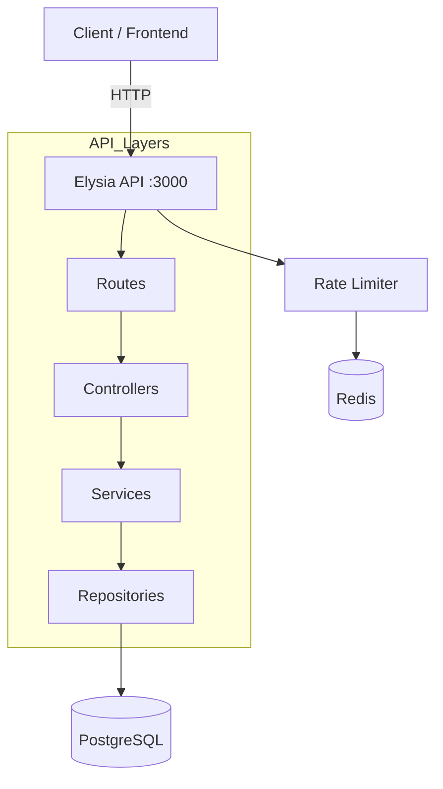
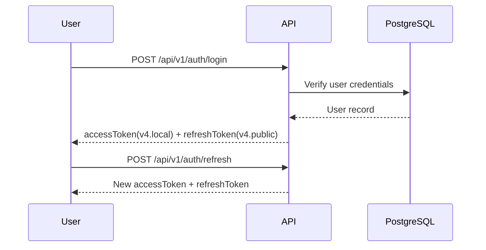

# 🚀 Bun + Elysia + PASETO Monolith Boilerplate


**Monolith REST API boilerplate** using **Bun + Elysia + PASETO** with PostgreSQL (Drizzle ORM) and Redis (rate limiting).

This boilerplate is focused on core API domains only:

- 🔐 Authentication
- 👤 User profile and user management
- 📦 Product management

---

## 📚 Table of Contents

- [Features](#-features)
- [System Architecture](#-system-architecture)
- [Project Structure](#-project-structure)
- [Prerequisites](#-prerequisites)
- [Getting Started](#-getting-started)
- [Available Scripts](#-available-scripts)
- [API Overview](#-api-overview)
- [Standard Response Format](#-standard-response-format)
- [Testing](#-testing)
- [Deployment (Docker Only)](#-deployment-docker-only)
- [Documentation](#-documentation)
- [Troubleshooting](#-troubleshooting)

---

## ✨ Features

- **Monolith-first design**: single deployable API service with clean layered architecture.
- **PASETO v4 hybrid tokens**:
  - `v4.local` encrypted access token
  - `v4.public` signed refresh token
- **Drizzle ORM + PostgreSQL**: type-safe schema and query layer.
- **Redis rate limiting**: supports IP-based and user-or-IP strategies.
- **Go-style response envelope**: consistent response shape for success/error.
- **Security baseline**: Argon2 password hashing, validation, auth middleware.
- **Observability-ready**: health endpoints, structured logging, optional metrics/tracing plugins.
- **Docker-ready**: production-like compose setup with API + PostgreSQL + Redis + Nginx.

---

## 🏗 System Architecture

### High-Level Monolith Flow



### Authentication Token Flow (PASETO)



---

## 📁 Project Structure

```bash
bun-elysia-paseto-boilerplate/
├── src/
│   ├── app.ts
│   ├── server.ts
│   ├── config/
│   ├── controllers/
│   ├── core/
│   │   ├── crypto/
│   │   ├── errors/
│   │   ├── http/
│   │   ├── logging/
│   │   ├── paseto/
│   │   ├── redis/
│   │   └── security/
│   ├── database/
│   │   ├── migrations/
│   │   └── schema/
│   ├── middlewares/
│   ├── plugins/
│   ├── repositories/
│   ├── routes/
│   └── services/
├── tests/
│   ├── core/
│   ├── database/
│   ├── load/
│   ├── performance/
│   └── unit/
├── infra/
│   ├── docker/
│   ├── nginx/
│   ├── docker-compose.prod.yaml
│   └── deployment.sh
├── scripts/
└── docs/
```

---

## ✅ Prerequisites

1. **Bun** `>= 1.0`
2. **Docker + Docker Compose**
3. **PostgreSQL** and **Redis** (can be local containers)

---

## 🚀 Getting Started

### 1. Clone & Install

```bash
git clone <your-repo-url>
cd bun-elysia-paseto-boilerplate
bun install
```

### 2. Setup Environment

```bash
cp .env.example .env
```

### 3. Generate PASETO Keys

```bash
bun run generate:paseto-keys
```

Copy the generated values into your `.env`:

- `PASETO_LOCAL_KEY`
- `PASETO_PUBLIC_KEY`
- `PASETO_SECRET_KEY`

### 4. Start PostgreSQL + Redis (Local)

```bash
docker run --name bun-elysia-pg \
  -e POSTGRES_USER=postgres \
  -e POSTGRES_PASSWORD=postgres \
  -e POSTGRES_DB=bun_elysia_paseto \
  -p 5432:5432 -d postgres:16-alpine

docker run --name bun-elysia-redis \
  -p 6379:6379 -d redis:7-alpine
```

### 5. Run Migrations

```bash
bun run db:migrate
```

### 6. Start API

```bash
bun run dev
```

API default URL: `http://localhost:3000`

Quick checks:

```bash
curl http://localhost:3000/health/live
curl http://localhost:3000/health
```

Swagger UI:

- `http://localhost:3000/swagger`

---

## 🧰 Available Scripts

| Script                         | Description                           |
| :----------------------------- | :------------------------------------ |
| `bun run dev`                  | Start development server (watch mode) |
| `bun run start`                | Start production server               |
| `bun run test`                 | Run default test suite                |
| `bun run test:load`            | Run load/performance suites (opt-in)  |
| `bun run test:coverage`        | Run tests with coverage               |
| `bun run lint`                 | Lint source files                     |
| `bun run lint:fix`             | Auto-fix lint issues                  |
| `bun run format`               | Format repository files               |
| `bun run format:check`         | Check formatting                      |
| `bun run db:generate`          | Generate Drizzle migrations           |
| `bun run db:migrate`           | Apply migrations                      |
| `bun run db:seed`              | Seed database                         |
| `bun run db:studio`            | Open Drizzle Studio                   |
| `bun run generate:paseto-keys` | Generate PASETO keys                  |

---

## 📖 API Overview

Base prefix: `/api/v1`

### 🔐 Auth

- `POST /api/v1/auth/register`
- `POST /api/v1/auth/login`
- `POST /api/v1/auth/refresh`
- `POST /api/v1/auth/logout`
- `GET /api/v1/auth/me`
- `POST /api/v1/auth/change-password`

### 👤 Users

- `GET /api/v1/users/me`
- `PATCH /api/v1/users/me`
- `GET /api/v1/users`
- `GET /api/v1/users/stats`
- `GET /api/v1/users/:id`
- `POST /api/v1/users/:id/activate`
- `POST /api/v1/users/:id/deactivate`
- `DELETE /api/v1/users/:id` (`?force=true` optional)
- `POST /api/v1/users/:id/restore`
- `GET /api/v1/activity-logs`

### 📦 Products

- `POST /api/v1/products`
- `GET /api/v1/products`
- `GET /api/v1/products/:id`
- `PUT /api/v1/products/:id`
- `DELETE /api/v1/products/:id` (`?force=true` optional)
- `POST /api/v1/products/:id/restore`
- `PUT /api/v1/products/:id/stock`

### 🩺 System

- `GET /health`
- `GET /health/live`
- `GET /health/ready`
- `GET /swagger`

---

## 📦 Standard Response Format

Success example:

```json
{
  "success": true,
  "message": "Request successful",
  "data": {
    "id": "..."
  },
  "meta": {
    "timestamp": "2026-03-12T11:00:00.000Z",
    "request_id": "..."
  }
}
```

Error example:

```json
{
  "success": false,
  "error": {
    "code": "UNAUTHORIZED",
    "message": "Authentication required"
  },
  "meta": {
    "timestamp": "2026-03-12T11:00:00.000Z",
    "request_id": "..."
  }
}
```

---

## 🧪 Testing

Default test run:

```bash
bun run test
```

Load/performance tests are intentionally opt-in:

```bash
bun run test:load
```

---

## 🐳 Deployment (Docker Only)

This boilerplate is currently **Docker-focused**.

Run production-like stack from infra:

```bash
cd infra
docker compose -f docker-compose.prod.yaml up -d --build
```

Or use deployment helper script:

```bash
./infra/deployment.sh <image-name> <tag> <registry>
```

Example:

```bash
./infra/deployment.sh bun-elysia-paseto-api v1.0.0 docker.io/my-org
```

---

## 📘 Documentation

- [`docs/standardization/README.md`](docs/standardization/README.md)
- [`docs/standardization/PASETO_GUIDE.md`](docs/standardization/PASETO_GUIDE.md)
- [`docs/deployment/production.md`](docs/deployment/production.md)
- [`docs/operations/runbook.md`](docs/operations/runbook.md)
- [`docs/operations/monitoring.md`](docs/operations/monitoring.md)

---

## 🔧 Troubleshooting

| Issue                        | Cause                                         | Fix                                                         |
| :--------------------------- | :-------------------------------------------- | :---------------------------------------------------------- |
| `Database connection failed` | PostgreSQL not running / wrong `DATABASE_URL` | Start Postgres container and re-check `.env`                |
| `Redis connection failed`    | Redis not running / wrong host or port        | Start Redis container and verify `REDIS_HOST`, `REDIS_PORT` |
| `Invalid PASETO key`         | Missing or malformed PASETO keys              | Re-run `bun run generate:paseto-keys` and update `.env`     |
| `429 Too Many Requests`      | Rate limiter threshold exceeded               | Wait for rate limit window reset                            |

---

Built for practical API delivery with **Bun + Elysia + PASETO**.

## 📜 License

This project is licensed under the MIT License.
