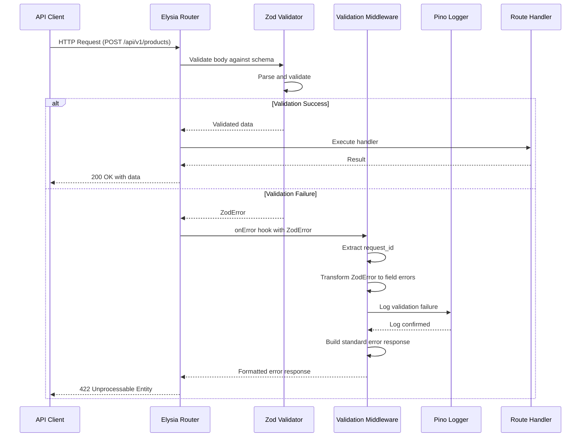

# Request Validation Middleware Design Document

**Document Version:** 1.0.0
**Date:** 2026-03-13
**Author:** Design Team
**Status:** Draft

## Table of Contents

1. [Overview](#1-overview)
2. [Architecture](#2-architecture)
3. [File Structure](#3-file-structure)
4. [API Design](#4-api-design)
5. [Implementation Details](#5-implementation-details)
6. [Testing Strategy](#6-testing-strategy)
7. [Usage Examples](#7-usage-examples)
8. [Dependencies](#8-dependencies)
9. [Configuration](#9-configuration)
10. [Success Criteria](#10-success-criteria)

---

## 1. Overview

### 1.1 Purpose and Goals

The Request Validation Middleware feature is designed to provide a centralized, consistent approach to handling Zod validation errors across all routes in the Bun + Elysia + PASETO monolith REST API boilerplate. This middleware serves as a critical component in the request processing pipeline, ensuring that invalid input is caught early, formatted appropriately, and logged for monitoring purposes.

The primary goals of this middleware are:

1. **Centralized Error Handling**: Provide a single point of entry for all Zod validation errors, eliminating the need for individual error handling in each route handler.
2. **Consistent API Responses**: Ensure that validation errors return a standardized response format that matches the existing `errorResponse()` pattern used throughout the application.
3. **Field-Level Error Details**: Deliver granular error information to API consumers, enabling them to understand exactly which fields failed validation and why.
4. **Monitoring and Debugging**: Log validation failures with sufficient context to support monitoring, debugging, and potential security analysis.
5. **Seamless Integration**: Integrate smoothly with the existing `onError` handler in `app.ts` without requiring significant refactoring of current route handlers.

### 1.2 Problem Being Solved

Currently, the application uses Zod schemas for request validation in route definitions (e.g., `body: registerRequestSchema`, `query: getProductsQuerySchema`), but when validation fails, Elysia's default error handling is used, which may not align with the application's standardized error response format. This creates inconsistencies in error responses across different endpoints and makes it difficult for API consumers to handle validation errors predictably.

Additionally, without centralized logging of validation failures, the application lacks visibility into:

- Which endpoints are receiving invalid input
- Common validation failure patterns
- Potential malicious activity or API misuse
- Field-level error rates that could indicate UX issues

The Request Validation Middleware addresses these problems by intercepting Zod validation errors, transforming them into the expected format, and logging them appropriately before they reach the client.

---

## 2. Architecture

### 2.1 Middleware Position in Request Flow

The Request Validation Middleware operates within Elysia's lifecycle hooks, specifically leveraging the `onError` hook to catch validation errors that occur during the request processing pipeline. Here's how it fits into the overall request flow:

```
┌─────────────────────────────────────────────────────────────────────────────┐
│                          HTTP Request                                       │
└─────────────────────────────┬───────────────────────────────────────────────┘
                              │
                              ▼
┌─────────────────────────────────────────────────────────────────────────────┐
│                    CORS Middleware                                           │
│              - Validates CORS headers                                        │
│              - Handles preflight requests                                    │
└─────────────────────────────┬───────────────────────────────────────────────┘
                              │
                              ▼
┌─────────────────────────────────────────────────────────────────────────────┐
│                   Request ID Middleware                                      │
│            - Generates/propagates X-Request-ID                               │
└─────────────────────────────┬───────────────────────────────────────────────┘
                              │
                              ▼
┌─────────────────────────────────────────────────────────────────────────────┐
│                   Logging Middleware                                         │
│              - Logs incoming requests                                        │
└─────────────────────────────┬───────────────────────────────────────────────┘
                              │
                              ▼
┌─────────────────────────────────────────────────────────────────────────────┐
│                   Rate Limiting Middleware                                   │
│              - Enforces rate limits per route                                │
└─────────────────────────────┬───────────────────────────────────────────────┘
                              │
                              ▼
┌─────────────────────────────────────────────────────────────────────────────┐
│                   Authentication Middleware                                  │
│              - Validates PASETO tokens                                       │
│              - Attaches user context                                         │
└─────────────────────────────┬───────────────────────────────────────────────┘
                              │
                              ▼
┌─────────────────────────────────────────────────────────────────────────────┐
│              Zod Schema Validation (Elysia Built-in)                         │
│              - Validates body, query, params, headers                        │
│              - Throws ValidationError on failure                             │
└─────────────────────────────┬───────────────────────────────────────────────┘
                              │
                  ┌───────────┴───────────┐
                  │                       │
                  ▼                       ▼
         Validation Success        Validation Failure
                  │                       │
                  │                       ▼
                  │         ┌───────────────────────────────────────────────┐
                  │         │     Request Validation Middleware             │
                  │         │  - Catches ZodValidationError                 │
                  │         │  - Transforms to standard error format        │
                  │         │  - Logs validation failure                    │
                  │         │  - Returns 422 status                         │
                  │         └─────────────────┬─────────────────────────────┘
                  │                             │
                  │                             ▼
                  │         ┌───────────────────────────────────────────────┐
                  │         │              HTTP Response                     │
                  │         │      { success: false,                        │
                  │         │        data: { code, message, details },      │
                  │         │        meta: { timestamp, request_id } }      │
                  │         └───────────────────────────────────────────────┘
                  │
                  ▼
┌─────────────────────────────────────────────────────────────────────────────┐
│                   Route Handler                                              │
│              - Business logic execution                                      │
└─────────────────────────────┬───────────────────────────────────────────────┘
                              │
                              ▼
┌─────────────────────────────────────────────────────────────────────────────┐
│                   Response Formatting                                        │
│              - Wraps in successResponse()                                    │
└─────────────────────────────┬───────────────────────────────────────────────┘
                              │
                              ▼
                    ┌─────────────────┐
                    │  HTTP Response   │
                    └─────────────────┘
```

### 2.2 Integration with Existing Code

The middleware integrates with the existing codebase at several key points:

#### 2.2.1 Global Error Handler Integration

The middleware will be registered as a global `onError` hook in `app.ts`, ensuring it catches validation errors from all routes:

```typescript
// src/app.ts (existing file to be modified)
import { validationErrorHandler } from './middlewares/validation.middleware';

export function createApp() {
  const app = new Elysia()
    // ... existing middleware setup
    .onError(ctx => {
      // Try validation error handler first
      const validationResponse = validationErrorHandler(ctx);
      if (validationResponse) {
        return validationResponse;
      }

      // Fall through to existing error handling
      const { error, set, request } = ctx;
      // ... existing error handling logic
    });
}
```

#### 2.2.2 Logger Integration

The middleware uses the existing Pino logger instance from `src/core/logging/logger.ts`:

```typescript
import { logger } from '../core/logging/logger';
```

#### 2.2.3 Error Response Integration

The middleware uses the existing `errorResponse()` function from `src/core/http/response.ts` to ensure consistency:

```typescript
import { errorResponse } from '../core/http/response';
```

#### 2.2.4 Error Type Integration

The middleware can leverage the existing `ValidationError` class from `src/core/errors/app-error.ts` for application-level validation errors:

```typescript
import { ValidationError } from '../core/errors/app-error';
```

### 2.3 Sequence Diagram



---

## 3. File Structure

### 3.1 New Files to Create

```
src/
└── middlewares/
    ├── validation.middleware.ts          # Main validation error handler
    ├── validation/
    │   ├── index.ts                      # Barrel exports
    │   ├── types.ts                      # TypeScript interfaces and types
    │   ├── error-formatter.ts            # Error formatting utilities
    │   ├── field-error.ts                # Field error class
    │   └── constants.ts                  # Error codes and messages
    └── index.ts                          # Updated to export validation middleware
```

### 3.2 Existing Files to Modify

```
src/
├── app.ts                                # Add validation error handler to onError hook
└── middlewares/
    └── index.ts                          # Export validation middleware
```

### 3.3 Test Files to Create

```
tests/
├── middlewares/
│   └── validation.middleware.test.ts     # Unit tests for validation middleware
└── integration/
    └── validation-error-handling.test.ts # Integration tests for validation errors
```

### 3.4 Complete Folder Structure

After implementation, the project structure will include:

```
bun-elysia-paseto-boilerplate/
├── docs/
│   └── plans/
│       └── 2026-03-13-request-validation-middleware-design.md
├── src/
│   ├── middlewares/
│   │   ├── auth.middleware.ts
│   │   ├── rate-limit.middleware.ts
│   │   ├── request-id.middleware.ts
│   │   ├── validation.middleware.ts          # NEW
│   │   ├── validation/                        # NEW DIRECTORY
│   │   │   ├── index.ts
│   │   │   ├── types.ts
│   │   │   ├── error-formatter.ts
│   │   │   ├── field-error.ts
│   │   │   └── constants.ts
│   │   └── index.ts
│   ├── app.ts                                 # MODIFIED
│   └── ...
├── tests/
│   ├── middlewares/
│   │   └── validation.middleware.test.ts      # NEW
│   └── integration/
│       └── validation-error-handling.test.ts  # NEW
└── ...
```

---

## 4. API Design

### 4.1 Middleware Interface

#### 4.1.1 Main Export Function

```typescript
/**
 * Validation error handler for Elysia onError hook
 *
 * This function checks if the error is a Zod validation error and
 * returns a standardized error response if so. Returns undefined for
 * non-validation errors, allowing them to fall through to other handlers.
 *
 * @param ctx - Elysia error context
 * @returns Standardized error response or undefined
 */
export function validationErrorHandler(ctx: ElysiaErrorHandlerContext): ElysiaValidationErrorResponse | undefined;
```

#### 4.1.2 Type Definitions

```typescript
/**
 * Elysia error handler context
 * Extends the base Elysia context with error-specific properties
 */
interface ElysiaErrorHandlerContext {
  error: unknown;
  set: { status: number };
  request: Request;
  code?: string;
  requestId?: string;
}

/**
 * Validation error response matching the application's standard format
 */
interface ElysiaValidationErrorResponse {
  success: false;
  message: string;
  data: {
    code: string;
    message: string;
    details: FieldError[];
  };
  meta: {
    timestamp: string;
    request_id?: string;
  };
}
```

### 4.2 Error Types and Classes

#### 4.2.1 Field Error Class

```typescript
/**
 * Represents a single field validation error
 */
export class FieldError {
  constructor(
    public readonly field: string,
    public readonly message: string,
    public readonly code: FieldErrorCode,
    public readonly received?: unknown,
    public readonly expected?: string
  ) {}

  /**
   * Convert to plain object for serialization
   */
  toJSON(): FieldErrorObject {
    return {
      field: this.field,
      message: this.message,
      code: this.code,
      ...(this.received !== undefined && { received: this.received }),
      ...(this.expected !== undefined && { expected: this.expected }),
    };
  }

  /**
   * Create from Zod issue
   */
  static fromZodIssue(issue: z.ZodIssue): FieldError {
    const field = joinPath(issue.path);
    const code = mapZodCodeToFieldErrorCode(issue.code);
    const message = getFieldErrorMessage(code, field, issue);

    return new FieldError(field, message, code, issue.received, getExpectedValue(issue));
  }
}

/**
 * Field error object for JSON serialization
 */
interface FieldErrorObject {
  field: string;
  message: string;
  code: FieldErrorCode;
  received?: unknown;
  expected?: string;
}
```

#### 4.2.2 Field Error Codes

```typescript
/**
 * Standardized field error codes
 */
export enum FieldErrorCode {
  // String errors
  INVALID_STRING = 'INVALID_STRING',
  TOO_SHORT = 'TOO_SHORT',
  TOO_LONG = 'TOO_LONG',
  INVALID_EMAIL = 'INVALID_EMAIL',
  INVALID_URL = 'INVALID_URL',
  INVALID_FORMAT = 'INVALID_FORMAT',

  // Number errors
  INVALID_NUMBER = 'INVALID_NUMBER',
  NOT_POSITIVE = 'NOT_POSITIVE',
  NOT_NEGATIVE = 'NOT_NEGATIVE',
  TOO_SMALL = 'TOO_SMALL',
  TOO_LARGE = 'TOO_LARGE',
  NOT_INTEGER = 'NOT_INTEGER',

  // Boolean errors
  INVALID_BOOLEAN = 'INVALID_BOOLEAN',

  // Date errors
  INVALID_DATE = 'INVALID_DATE',

  // Array errors
  INVALID_ARRAY = 'INVALID_ARRAY',
  TOO_FEW_ITEMS = 'TOO_FEW_ITEMS',
  TOO_MANY_ITEMS = 'TOO_MANY_ITEMS',

  // Object errors
  INVALID_OBJECT = 'INVALID_OBJECT',
  MISSING_FIELD = 'MISSING_FIELD',
  UNRECOGNIZED_FIELD = 'UNRECOGNIZED_FIELD',

  // Union and option errors
  INVALID_TYPE = 'INVALID_TYPE',
  REQUIRED = 'REQUIRED',

  // Custom errors
  CUSTOM = 'CUSTOM',
  REFINE_FAILED = 'REFINE_FAILED',
}
```

### 4.3 Helper Functions

#### 4.3.1 Error Detection

```typescript
/**
 * Check if error is a Zod validation error
 */
export function isZodError(error: unknown): error is z.ZodError {
  return error instanceof Error && 'name' in error && error.name === 'ZodError' && 'issues' in error && Array.isArray((error as z.ZodError).issues);
}

/**
 * Check if error should be handled by validation middleware
 */
export function isValidationError(error: unknown): boolean {
  return isZodError(error) || error instanceof ValidationError;
}
```

#### 4.3.2 Error Transformation

```typescript
/**
 * Transform Zod error to field errors array
 */
export function transformZodError(error: z.ZodError): FieldError[] {
  return error.issues.map(issue => FieldError.fromZodIssue(issue));
}

/**
 * Transform validation error to response details
 */
export function transformValidationDetails(error: z.ZodError | ValidationError): FieldError[] {
  if (isZodError(error)) {
    return transformZodError(error);
  }

  // Handle application ValidationError
  if (Array.isArray(error.details)) {
    return error.details as FieldError[];
  }

  return [];
}
```

#### 4.3.3 Path Utilities

```typescript
/**
 * Join Zod path array into dot-notation string
 */
export function joinPath(path: (string | number)[]): string {
  return path
    .map(segment => {
      if (typeof segment === 'number') {
        return `[${segment}]`;
      }
      return segment;
    })
    .join('.')
    .replace(/\.\[/g, '[');
}

/**
 * Get human-readable field label from path
 */
export function getFieldLabel(fieldPath: string): string {
  return fieldPath
    .split(/\.|\[|\]/)
    .filter(Boolean)
    .map(segment => {
      // Convert camelCase to Title Case
      return segment.replace(/([a-z])([A-Z])/g, '$1 $2').replace(/^./, str => str.toUpperCase());
    })
    .join(' → ');
}
```

#### 4.3.4 Message Formatting

```typescript
/**
 * Get user-friendly error message for field error
 */
export function getFieldErrorMessage(code: FieldErrorCode, field: string, issue?: z.ZodIssue): string {
  const label = getFieldLabel(field);

  switch (code) {
    case FieldErrorCode.REQUIRED:
      return `${label} is required`;
    case FieldErrorCode.INVALID_EMAIL:
      return `${label} must be a valid email address`;
    case FieldErrorCode.TOO_SHORT:
      const minLength = issue?.minimum ?? 0;
      return `${label} must be at least ${minLength} character${minLength !== 1 ? 's' : ''}`;
    case FieldErrorCode.TOO_LONG:
      const maxLength = issue?.maximum ?? 0;
      return `${label} must not exceed ${maxLength} character${maxLength !== 1 ? 's' : ''}`;
    case FieldErrorCode.NOT_POSITIVE:
      return `${label} must be a positive number`;
    case FieldErrorCode.TOO_SMALL:
      const min = issue?.minimum ?? 0;
      return `${label} must be at least ${min}`;
    case FieldErrorCode.TOO_LARGE:
      const max = issue?.maximum ?? 0;
      return `${label} must not exceed ${max}`;
    default:
      return issue?.message ?? `${label} is invalid`;
  }
}
```

#### 4.3.5 Code Mapping

```typescript
/**
 * Map Zod error code to field error code
 */
export function mapZodCodeToFieldErrorCode(zodCode: z.ZodIssueCode): FieldErrorCode {
  const mapping: Record<z.ZodIssueCode, FieldErrorCode> = {
    invalid_string: FieldErrorCode.INVALID_STRING,
    too_small: FieldErrorCode.TOO_SMALL,
    too_big: FieldErrorCode.TOO_LARGE,
    invalid_type: FieldErrorCode.INVALID_TYPE,
    invalid_union: FieldErrorCode.INVALID_TYPE,
    invalid_literal: FieldErrorCode.INVALID_FORMAT,
    custom: FieldErrorCode.CUSTOM,
    invalid_arguments: FieldErrorCode.INVALID_OBJECT,
    invalid_return_type: FieldErrorCode.INVALID_TYPE,
    invalid_date: FieldErrorCode.INVALID_DATE,
    invalid_enum: FieldErrorCode.INVALID_FORMAT,
  };

  return mapping[zodCode] ?? FieldErrorCode.CUSTOM;
}
```

### 4.4 Logger Integration

#### 4.4.1 Logging Context

```typescript
/**
 * Validation error logging context
 */
interface ValidationErrorLogContext {
  request_id?: string;
  method: string;
  url: string;
  field_errors: number;
  fields: string[];
  error_codes: string[];
  user_id?: string;
  ip?: string;
  user_agent?: string;
}

/**
 * Build logging context from validation error
 */
export function buildValidationLogContext(error: z.ZodError, ctx: ElysiaErrorHandlerContext): ValidationErrorLogContext {
  const fieldErrors = transformZodError(error);

  return {
    request_id: ctx.requestId,
    method: ctx.request.method,
    url: ctx.request.url,
    field_errors: fieldErrors.length,
    fields: fieldErrors.map(fe => fe.field),
    error_codes: [...new Set(fieldErrors.map(fe => fe.code))],
    user_id: getUserIdFromContext(ctx),
    ip: getClientIp(ctx.request),
    user_agent: ctx.request.headers.get('user-agent') ?? undefined,
  };
}
```

---

## 5. Implementation Details

### 5.1 Step-by-Step Implementation Guide

#### Step 1: Create Type Definitions

Create `src/middlewares/validation/types.ts` with all TypeScript interfaces and types:

```typescript
import type { z } from 'zod';
import type { FieldError } from './field-error';
import type { FieldErrorCode } from './constants';

/**
 * Elysia error handler context
 */
export interface ElysiaErrorHandlerContext {
  error: unknown;
  set: { status: number };
  request: Request;
  code?: string;
  requestId?: string;
  user?: {
    id: string;
    email?: string;
    role?: string;
  } | null;
}

/**
 * Validation error response
 */
export interface ValidationErrorResponse {
  success: false;
  message: string;
  data: {
    code: string;
    message: string;
    details: FieldError[];
  };
  meta: {
    timestamp: string;
    request_id?: string;
  };
}

/**
 * Field error for JSON serialization
 */
export interface FieldErrorObject {
  field: string;
  message: string;
  code: FieldErrorCode;
  received?: unknown;
  expected?: string;
}

/**
 * Validation error logging context
 */
export interface ValidationErrorLogContext {
  request_id?: string;
  method: string;
  url: string;
  field_errors: number;
  fields: string[];
  error_codes: string[];
  user_id?: string;
  ip?: string;
  user_agent?: string;
}
```

#### Step 2: Create Constants

Create `src/middlewares/validation/constants.ts` with error codes and messages:

```typescript
/**
 * Standardized field error codes
 */
export enum FieldErrorCode {
  // String errors
  INVALID_STRING = 'INVALID_STRING',
  TOO_SHORT = 'TOO_SHORT',
  TOO_LONG = 'TOO_LONG',
  INVALID_EMAIL = 'INVALID_EMAIL',
  INVALID_URL = 'INVALID_URL',
  INVALID_FORMAT = 'INVALID_FORMAT',

  // Number errors
  INVALID_NUMBER = 'INVALID_NUMBER',
  NOT_POSITIVE = 'NOT_POSITIVE',
  NOT_NEGATIVE = 'NOT_NEGATIVE',
  TOO_SMALL = 'TOO_SMALL',
  TOO_LARGE = 'TOO_LARGE',
  NOT_INTEGER = 'NOT_INTEGER',

  // Boolean errors
  INVALID_BOOLEAN = 'INVALID_BOOLEAN',

  // Date errors
  INVALID_DATE = 'INVALID_DATE',

  // Array errors
  INVALID_ARRAY = 'INVALID_ARRAY',
  TOO_FEW_ITEMS = 'TOO_FEW_ITEMS',
  TOO_MANY_ITEMS = 'TOO_MANY_ITEMS',

  // Object errors
  INVALID_OBJECT = 'INVALID_OBJECT',
  MISSING_FIELD = 'MISSING_FIELD',
  UNRECOGNIZED_FIELD = 'UNRECOGNIZED_FIELD',

  // Union and option errors
  INVALID_TYPE = 'INVALID_TYPE',
  REQUIRED = 'REQUIRED',

  // Custom errors
  CUSTOM = 'CUSTOM',
  REFINE_FAILED = 'REFINE_FAILED',
}

/**
 * Response error codes
 */
export const VALIDATION_ERROR_CODES = {
  VALIDATION_FAILED: 'VALIDATION_FAILED',
  REQUEST_VALIDATION_ERROR: 'REQUEST_VALIDATION_ERROR',
  INVALID_INPUT: 'INVALID_INPUT',
} as const;

/**
 * Default error messages
 */
export const DEFAULT_ERROR_MESSAGES = {
  VALIDATION_FAILED: 'Request validation failed',
  MULTIPLE_FIELDS: 'Multiple validation errors occurred',
  SINGLE_FIELD: 'Validation error occurred',
} as const;
```

#### Step 3: Create Field Error Class

Create `src/middlewares/validation/field-error.ts`:

```typescript
import type { z } from 'zod';
import type { FieldErrorObject } from './types';
import { FieldErrorCode } from './constants';
import { getFieldErrorMessage } from './error-formatter';

/**
 * Represents a single field validation error
 */
export class FieldError {
  constructor(
    public readonly field: string,
    public readonly message: string,
    public readonly code: FieldErrorCode,
    public readonly received?: unknown,
    public readonly expected?: string
  ) {}

  /**
   * Convert to plain object for serialization
   */
  toJSON(): FieldErrorObject {
    const obj: FieldErrorObject = {
      field: this.field,
      message: this.message,
      code: this.code,
    };

    if (this.received !== undefined) {
      obj.received = this.received;
    }

    if (this.expected !== undefined) {
      obj.expected = this.expected;
    }

    return obj;
  }

  /**
   * Create from Zod issue
   */
  static fromZodIssue(issue: z.ZodIssue): FieldError {
    const field = joinPath(issue.path);
    const code = mapZodCodeToFieldErrorCode(issue.code);
    const message = getFieldErrorMessage(code, field, issue);

    return new FieldError(field, message, code, issue.received, getExpectedValue(issue));
  }
}

/**
 * Join Zod path array into dot-notation string
 */
function joinPath(path: (string | number)[]): string {
  return path
    .map(segment => {
      if (typeof segment === 'number') {
        return `[${segment}]`;
      }
      return segment;
    })
    .join('.')
    .replace(/\.\[/g, '[');
}

/**
 * Map Zod error code to field error code
 */
function mapZodCodeToFieldErrorCode(zodCode: z.ZodIssueCode): FieldErrorCode {
  const mapping: Record<z.ZodIssueCode, FieldErrorCode> = {
    invalid_string: FieldErrorCode.INVALID_STRING,
    too_small: FieldErrorCode.TOO_SMALL,
    too_big: FieldErrorCode.TOO_LARGE,
    invalid_type: FieldErrorCode.INVALID_TYPE,
    invalid_union: FieldErrorCode.INVALID_TYPE,
    invalid_literal: FieldErrorCode.INVALID_FORMAT,
    custom: FieldErrorCode.CUSTOM,
    invalid_arguments: FieldErrorCode.INVALID_OBJECT,
    invalid_return_type: FieldErrorCode.INVALID_TYPE,
    invalid_date: FieldErrorCode.INVALID_DATE,
  };

  return mapping[zodCode] ?? FieldErrorCode.CUSTOM;
}

/**
 * Get expected value from Zod issue
 */
function getExpectedValue(issue: z.ZodIssue): string | undefined {
  if ('minimum' in issue && issue.minimum !== undefined) {
    return `>= ${issue.minimum}`;
  }
  if ('maximum' in issue && issue.maximum !== undefined) {
    return `<= ${issue.maximum}`;
  }
  if ('expectedType' in issue) {
    return String(issue.expectedType);
  }
  return undefined;
}
```

#### Step 4: Create Error Formatter

Create `src/middlewares/validation/error-formatter.ts`:

```typescript
import type { z } from 'zod';
import { FieldErrorCode } from './constants';

/**
 * Get user-friendly error message for field error
 */
export function getFieldErrorMessage(code: FieldErrorCode, field: string, issue?: z.ZodIssue): string {
  const label = getFieldLabel(field);

  switch (code) {
    case FieldErrorCode.REQUIRED:
      return `${label} is required`;

    case FieldErrorCode.INVALID_EMAIL:
      return `${label} must be a valid email address`;

    case FieldErrorCode.TOO_SHORT:
      const minLength = getMinimum(issue);
      return `${label} must be at least ${minLength} character${minLength !== 1 ? 's' : ''}`;

    case FieldErrorCode.TOO_LONG:
      const maxLength = getMaximum(issue);
      return `${label} must not exceed ${maxLength} character${maxLength !== 1 ? 's' : ''}`;

    case FieldErrorCode.NOT_POSITIVE:
      return `${label} must be a positive number`;

    case FieldErrorCode.TOO_SMALL:
      const min = getMinimum(issue);
      return `${label} must be at least ${min}`;

    case FieldErrorCode.TOO_LARGE:
      const max = getMaximum(issue);
      return `${label} must not exceed ${max}`;

    case FieldErrorCode.INVALID_TYPE:
      const expectedType = getExpectedType(issue);
      return `${label} must be ${article(expectedType)} ${expectedType}`;

    case FieldErrorCode.INVALID_ARRAY:
      return `${label} must be an array`;

    case FieldErrorCode.INVALID_OBJECT:
      return `${label} must be an object`;

    case FieldErrorCode.INVALID_DATE:
      return `${label} must be a valid date`;

    case FieldErrorCode.TOO_FEW_ITEMS:
      const minItems = getMinimum(issue);
      return `${label} must have at least ${minItems} item${minItems !== 1 ? 's' : ''}`;

    case FieldErrorCode.TOO_MANY_ITEMS:
      const maxItems = getMaximum(issue);
      return `${label} must not have more than ${maxItems} item${maxItems !== 1 ? 's' : ''}`;

    default:
      return issue?.message ?? `${label} is invalid`;
  }
}

/**
 * Get human-readable field label from path
 */
export function getFieldLabel(fieldPath: string): string {
  if (!fieldPath) {
    return 'Field';
  }

  return fieldPath
    .split(/\.|\[|\]/)
    .filter(Boolean)
    .map(segment => {
      // Convert camelCase to Title Case
      return segment.replace(/([a-z])([A-Z])/g, '$1 $2').replace(/^./, str => str.toUpperCase());
    })
    .join(' → ');
}

/**
 * Get article for word (a/an)
 */
function article(word: string): string {
  const vowels = ['a', 'e', 'i', 'o', 'u'];
  const firstChar = word.charAt(0).toLowerCase();
  return vowels.includes(firstChar) ? 'an' : 'a';
}

/**
 * Get minimum value from issue
 */
function getMinimum(issue?: z.ZodIssue): number {
  if (!issue) return 0;
  if ('minimum' in issue && typeof issue.minimum === 'number') {
    return issue.minimum;
  }
  return 0;
}

/**
 * Get maximum value from issue
 */
function getMaximum(issue?: z.ZodIssue): number {
  if (!issue) return 0;
  if ('maximum' in issue && typeof issue.maximum === 'number') {
    return issue.maximum;
  }
  return 0;
}

/**
 * Get expected type from issue
 */
function getExpectedType(issue?: z.ZodIssue): string {
  if (!issue) return 'valid value';
  if ('expectedType' in issue) {
    return String(issue.expected);
  }
  if (issue.code === 'invalid_type' && issue.expected) {
    return String(issue.expected);
  }
  return 'valid value';
}
```

#### Step 5: Create Main Middleware

Create `src/middlewares/validation.middleware.ts`:

```typescript
import type { z } from 'zod';
import { errorResponse } from '../core/http/response';
import { ValidationError } from '../core/errors/app-error';
import { logger } from '../core/logging/logger';
import type { ElysiaErrorHandlerContext, ValidationErrorLogContext } from './validation/types';
import { FieldError } from './validation/field-error';
import { VALIDATION_ERROR_CODES, DEFAULT_ERROR_MESSAGES } from './validation/constants';

/**
 * Validation error handler for Elysia onError hook
 *
 * This function checks if the error is a Zod validation error and
 * returns a standardized error response if so. Returns undefined for
 * non-validation errors, allowing them to fall through to other handlers.
 *
 * @param ctx - Elysia error context
 * @returns Standardized error response or undefined
 */
export function validationErrorHandler(ctx: ElysiaErrorHandlerContext): ReturnType<typeof errorResponse> | undefined {
  const { error, set, request } = ctx;

  // Check if this is a validation error we should handle
  if (!isValidationError(error)) {
    return undefined;
  }

  // Set the appropriate status code
  set.status = 422;

  // Transform the error
  let fieldErrors: FieldError[];
  let errorCode = VALIDATION_ERROR_CODES.VALIDATION_FAILED;
  let message = DEFAULT_ERROR_MESSAGES.VALIDATION_FAILED;

  if (isZodError(error)) {
    fieldErrors = transformZodError(error);

    // Customize message based on number of errors
    message = fieldErrors.length > 1 ? DEFAULT_ERROR_MESSAGES.MULTIPLE_FIELDS : DEFAULT_ERROR_MESSAGES.SINGLE_FIELD;
  } else if (error instanceof ValidationError) {
    fieldErrors = error.details as FieldError[];
    message = error.message;
    errorCode = error.code;
  } else {
    fieldErrors = [];
  }

  // Extract request ID
  const requestId = extractRequestId(ctx);

  // Log the validation failure
  const logContext = buildValidationLogContext(error, ctx, fieldErrors);
  logger.warn('Request validation failed', logContext);

  // Build and return the error response
  return errorResponse(
    request,
    errorCode,
    message,
    fieldErrors.map(fe => fe.toJSON()),
    requestId
  );
}

/**
 * Check if error is a Zod validation error
 */
function isZodError(error: unknown): error is z.ZodError {
  return error instanceof Error && 'name' in error && error.name === 'ZodError' && 'issues' in error && Array.isArray((error as z.ZodError).issues);
}

/**
 * Check if error should be handled by validation middleware
 */
function isValidationError(error: unknown): boolean {
  return isZodError(error) || error instanceof ValidationError;
}

/**
 * Transform Zod error to field errors array
 */
function transformZodError(error: z.ZodError): FieldError[] {
  return error.issues.map(issue => FieldError.fromZodIssue(issue));
}

/**
 * Extract request ID from context
 */
function extractRequestId(ctx: ElysiaErrorHandlerContext): string | undefined {
  // Try to get from context first
  if (ctx.requestId) {
    return ctx.requestId;
  }

  // Fall back to header
  return ctx.request.headers.get('x-request-id') ?? ctx.request.headers.get('X-Request-ID') ?? undefined;
}

/**
 * Build logging context from validation error
 */
function buildValidationLogContext(
  error: z.ZodError | ValidationError,
  ctx: ElysiaErrorHandlerContext,
  fieldErrors: FieldError[]
): ValidationErrorLogContext {
  return {
    request_id: extractRequestId(ctx),
    method: ctx.request.method,
    url: ctx.request.url,
    field_errors: fieldErrors.length,
    fields: fieldErrors.map(fe => fe.field),
    error_codes: [...new Set(fieldErrors.map(fe => fe.code))],
    user_id: ctx.user?.id,
    ip: getClientIp(ctx.request),
    user_agent: ctx.request.headers.get('user-agent') ?? undefined,
  };
}

/**
 * Get client IP from request
 */
function getClientIp(request: Request): string | undefined {
  return request.headers.get('x-forwarded-for')?.split(',')[0].trim() ?? request.headers.get('x-real-ip') ?? undefined;
}
```

#### Step 6: Create Barrel Export

Create `src/middlewares/validation/index.ts`:

```typescript
/**
 * Validation Middleware Barrel Export
 *
 * Central export point for all validation middleware functionality.
 */

export * from './types';
export * from './constants';
export * from './field-error';
export * from './error-formatter';
export { validationErrorHandler } from '../validation.middleware';
```

#### Step 7: Update Middleware Barrel

Update `src/middlewares/index.ts`:

```typescript
/**
 * Middlewares Barrel Export
 *
 * Central export point for all middleware.
 */

export * from './auth.middleware';
export * from './rate-limit.middleware';
export * from './request-id.middleware';
export * from './validation.middleware'; // NEW
```

#### Step 8: Integrate with App

Update `src/app.ts` to use the validation error handler:

```typescript
import { Elysia } from 'elysia';
import { cors } from '@elysiajs/cors';
import { swagger } from '@elysiajs/swagger';
import { logger } from './core/logging/logger';
import { loggingPlugin } from './core/logging/middleware';
import { getConnection } from './database/connection';
import { UnitOfWork } from './repositories/unit-of-work';
import { PasswordService } from './core/crypto/password.service';
import { PasetoService } from './core/paseto/paseto.service';
import { AuthService } from './services/auth.service';
import { UsersService } from './services/users.service';
import { ProductsService } from './services/products.service';
import { createAuthRoutes } from './routes/auth.routes';
import { createUsersRoutes } from './routes/users.routes';
import { createProductsRoutes } from './routes/products.routes';
import { AppError } from './core/errors/app-error';
import { registerPlugins } from './plugins';
import { requestId } from './middlewares/request-id.middleware';
import { errorResponse } from './core/http/response';
import { validationErrorHandler } from './middlewares/validation.middleware'; // NEW

export function createApp() {
  const db = getConnection();
  const unitOfWork = new UnitOfWork(db);
  const passwordService = new PasswordService();
  const pasetoService = new PasetoService({
    issuer: 'bun-elysia-paseto-boilerplate',
    audience: 'bun-elysia-api',
    symmetricKey: process.env.PASETO_LOCAL_KEY!,
    publicKey: process.env.PASETO_PUBLIC_KEY!,
    secretKey: process.env.PASETO_SECRET_KEY!,
    accessTokenExpiryMinutes: Number(process.env.ACCESS_TOKEN_EXPIRY_MINUTES) || 15,
    refreshTokenExpiryDays: Number(process.env.REFRESH_TOKEN_EXPIRY_DAYS) || 7,
  });

  const authService = new AuthService(unitOfWork, pasetoService, passwordService);
  const usersService = new UsersService(unitOfWork, passwordService);
  const productsService = new ProductsService(unitOfWork);

  const app = new Elysia()
    .use(
      cors({
        origin: process.env.CORS_ORIGIN || '*',
        credentials: process.env.CORS_CREDENTIALS === 'true',
        methods: (process.env.CORS_METHODS || 'GET,POST,PUT,DELETE,PATCH').split(','),
        allowedHeaders: (process.env.CORS_ALLOWED_HEADERS || 'Content-Type,Authorization,X-Request-ID').split(','),
      })
    )
    .use(requestId())
    .use(loggingPlugin)
    .use(registerPlugins)
    .onError(ctx => {
      // MODIFIED: Try validation error handler first
      const validationResponse = validationErrorHandler(ctx);
      if (validationResponse) {
        return validationResponse;
      }

      // Fall through to existing error handling
      const { error, set, request } = ctx;
      const requestId =
        typeof (ctx as { requestId?: unknown }).requestId === 'string' ? ((ctx as { requestId?: string }).requestId as string) : undefined;

      logger.error('Unhandled error', error);

      if (error instanceof AppError) {
        set.status = error.status;
        return errorResponse(request, error.code, error.message, error.details, requestId);
      }

      if (error instanceof Error) {
        set.status = 500;
        return errorResponse(
          request,
          'INTERNAL_ERROR',
          'An unexpected error occurred',
          process.env.NODE_ENV === 'development' ? error.message : undefined,
          requestId
        );
      }

      set.status = 500;
      return errorResponse(request, 'INTERNAL_ERROR', 'An unexpected error occurred', undefined, requestId);
    })
    .group('/api/v1', api =>
      api
        .use(createAuthRoutes(new Elysia(), authService, usersService, pasetoService))
        .use(createUsersRoutes(new Elysia(), usersService, authService, pasetoService))
        .use(createProductsRoutes(new Elysia(), productsService, authService, pasetoService))
    )
    .use(
      swagger({
        documentation: {
          info: {
            title: 'Bun Elysia PASETO API',
            version: '1.0.0',
            description: 'Monolith REST API with PASETO authentication',
          },
          tags: [
            { name: 'Authentication', description: 'User authentication endpoints' },
            { name: 'Users', description: 'User management endpoints' },
            { name: 'Products', description: 'Product management endpoints' },
          ],
        },
      })
    )
    .all('*', ctx => {
      const { set, request } = ctx;
      set.status = 404;
      const requestId =
        typeof (ctx as { requestId?: unknown }).requestId === 'string' ? ((ctx as { requestId?: string }).requestId as string) : undefined;
      return errorResponse(request, 'NOT_FOUND', 'Route not found', undefined, requestId);
    });

  logger.info('Application created successfully');

  return app;
}
```

### 5.2 Error Handling Patterns

#### 5.2.1 Handling Multiple Validation Errors

When multiple fields fail validation, the middleware aggregates all errors and returns them in the response:

```typescript
// Example Request Body
{
  "email": "invalid-email",
  "password": "weak",
  "age": -5
}

// Example Response
{
  "success": false,
  "message": "Multiple validation errors occurred",
  "data": {
    "code": "VALIDATION_FAILED",
    "message": "Request validation failed",
    "details": [
      {
        "field": "email",
        "message": "Email must be a valid email address",
        "code": "INVALID_EMAIL",
        "received": "invalid-email"
      },
      {
        "field": "password",
        "message": "Password must contain at least one uppercase letter",
        "code": "INVALID_FORMAT"
      },
      {
        "field": "age",
        "message": "Age must be at least 0",
        "code": "TOO_SMALL",
        "received": -5,
        "expected": ">= 0"
      }
    ]
  },
  "meta": {
    "timestamp": "2026-03-13T12:00:00.000Z",
    "request_id": "req_123abc"
  }
}
```

#### 5.2.2 Handling Nested Field Errors

For nested objects and arrays, the field path uses dot notation:

```typescript
// Example Request Body
{
  "product": {
    "name": "A",
    "variants": [
      { "sku": "", "price": -10 }
    ]
  }
}

// Example Response
{
  "success": false,
  "message": "Multiple validation errors occurred",
  "data": {
    "code": "VALIDATION_FAILED",
    "message": "Request validation failed",
    "details": [
      {
        "field": "product.name",
        "message": "Name must be at least 3 characters",
        "code": "TOO_SHORT",
        "received": "A",
        "expected": ">= 3"
      },
      {
        "field": "product.variants[0].sku",
        "message": "Sku is required",
        "code": "REQUIRED"
      },
      {
        "field": "product.variants[0].price",
        "message": "Price must be a positive number",
        "code": "NOT_POSITIVE",
        "received": -10
      }
    ]
  },
  "meta": {
    "timestamp": "2026-03-13T12:00:00.000Z",
    "request_id": "req_123abc"
  }
}
```

#### 5.2.3 Handling Custom Validation Errors

Application-level validation errors can use the `ValidationError` class:

```typescript
// In a route handler or service
throw new ValidationError('Invalid product configuration', {
  details: [
    {
      field: 'product.attributes',
      message: 'Attributes are required when creating variants',
      code: 'REFINE_FAILED',
    },
  ],
});

// Will be handled by the middleware and formatted consistently
```

### 5.3 Logging Strategy

The middleware implements a comprehensive logging strategy for validation failures:

#### 5.3.1 Log Levels

- **warn**: Used for validation failures (not critical but important for monitoring)
- **error**: Reserved for system errors in the validation process itself

#### 5.3.2 Log Content

Each validation failure logs:

```typescript
{
  level: 'warn',
  msg: 'Request validation failed',
  request_id: 'req_123abc',
  method: 'POST',
  url: 'https://api.example.com/api/v1/products',
  field_errors: 3,
  fields: ['email', 'password', 'age'],
  error_codes: ['INVALID_EMAIL', 'INVALID_FORMAT', 'TOO_SMALL'],
  user_id: 'user_456def',
  ip: '192.168.1.1',
  user_agent: 'Mozilla/5.0...'
}
```

#### 5.3.3 Sensitive Data Handling

The logger configuration in `src/core/logging/logger.ts` already redacts sensitive headers:

```typescript
redact: ['req.headers.authorization', 'req.headers.cookie'];
```

This ensures passwords and tokens in request bodies are not logged.

#### 5.3.4 Monitoring Integration

The structured logs enable:

- Alerting on high validation failure rates
- Identifying problematic fields for UX improvement
- Detecting potential attack patterns (e.g., repeated validation failures)
- Tracking validation error trends over time

---

## 6. Testing Strategy

### 6.1 Unit Test Cases

#### 6.1.1 Field Error Class Tests

File: `tests/middlewares/validation/field-error.test.ts`

```typescript
import { describe, it, expect } from 'bun:test';
import { z } from 'zod';
import { FieldError } from '../../src/middlewares/validation/field-error';
import { FieldErrorCode } from '../../src/middlewares/validation/constants';

describe('FieldError', () => {
  describe('constructor', () => {
    it('should create a field error with required properties', () => {
      const error = new FieldError('email', 'Email is required', FieldErrorCode.REQUIRED);

      expect(error.field).toBe('email');
      expect(error.message).toBe('Email is required');
      expect(error.code).toBe('REQUIRED');
    });

    it('should create a field error with optional properties', () => {
      const error = new FieldError('age', 'Age must be at least 18', FieldErrorCode.TOO_SMALL, 16, '>= 18');

      expect(error.received).toBe(16);
      expect(error.expected).toBe('>= 18');
    });
  });

  describe('toJSON', () => {
    it('should serialize to plain object without optional properties', () => {
      const error = new FieldError('email', 'Email is required', FieldErrorCode.REQUIRED);

      const json = error.toJSON();

      expect(json).toEqual({
        field: 'email',
        message: 'Email is required',
        code: 'REQUIRED',
      });
    });

    it('should serialize to plain object with optional properties', () => {
      const error = new FieldError('age', 'Age must be at least 18', FieldErrorCode.TOO_SMALL, 16, '>= 18');

      const json = error.toJSON();

      expect(json).toEqual({
        field: 'age',
        message: 'Age must be at least 18',
        code: 'TOO_SMALL',
        received: 16,
        expected: '>= 18',
      });
    });
  });

  describe('fromZodIssue', () => {
    it('should create FieldError from Zod required error', () => {
      const schema = z.object({ name: z.string().min(1) });
      const result = schema.safeParse({});

      if (!result.success) {
        const fieldError = FieldError.fromZodIssue(result.error.issues[0]);

        expect(fieldError.field).toBe('name');
        expect(fieldError.code).toBe(FieldErrorCode.TOO_SMALL);
        expect(fieldError.message).toContain('Name');
      }
    });

    it('should create FieldError from Zod email error', () => {
      const schema = z.object({ email: z.string().email() });
      const result = schema.safeParse({ email: 'invalid' });

      if (!result.success) {
        const fieldError = FieldError.fromZodIssue(result.error.issues[0]);

        expect(fieldError.field).toBe('email');
        expect(fieldError.code).toBe(FieldErrorCode.INVALID_STRING);
        expect(fieldError.message).toContain('Email');
      }
    });

    it('should handle nested field paths', () => {
      const schema = z.object({
        user: z.object({
          profile: z.object({
            bio: z.string().max(100),
          }),
        }),
      });

      const result = schema.safeParse({
        user: { profile: { bio: 'a'.repeat(101) } },
      });

      if (!result.success) {
        const fieldError = FieldError.fromZodIssue(result.error.issues[0]);

        expect(fieldError.field).toBe('user.profile.bio');
        expect(fieldError.code).toBe(FieldErrorCode.TOO_LARGE);
      }
    });

    it('should handle array indices in paths', () => {
      const schema = z.object({
        items: z.array(z.object({ name: z.string().min(1) })),
      });

      const result = schema.safeParse({
        items: [{ name: '' }],
      });

      if (!result.success) {
        const fieldError = FieldError.fromZodIssue(result.error.issues[0]);

        expect(fieldError.field).toBe('items[0].name');
        expect(fieldError.code).toBe(FieldErrorCode.TOO_SMALL);
      }
    });
  });
});
```

#### 6.1.2 Error Formatter Tests

File: `tests/middlewares/validation/error-formatter.test.ts`

```typescript
import { describe, it, expect } from 'bun:test';
import { getFieldLabel, getFieldErrorMessage } from '../../src/middlewares/validation/error-formatter';
import { FieldErrorCode } from '../../src/middlewares/validation/constants';

describe('Error Formatter', () => {
  describe('getFieldLabel', () => {
    it('should convert simple field name to label', () => {
      expect(getFieldLabel('email')).toBe('Email');
      expect(getFieldLabel('firstName')).toBe('First Name');
      expect(getFieldLabel('userProfile')).toBe('User Profile');
    });

    it('should convert nested path to label', () => {
      expect(getFieldLabel('user.profile.bio')).toBe('User → Profile → Bio');
      expect(getFieldLabel('address.street.line1')).toBe('Address → Street → Line 1');
    });

    it('should handle array indices', () => {
      expect(getFieldLabel('items[0].name')).toBe('Items → 0 → Name');
      expect(getFieldLabel('variants[1].attributes[0].value')).toBe('Variants → 1 → Attributes → 0 → Value');
    });

    it('should return default label for empty path', () => {
      expect(getFieldLabel('')).toBe('Field');
    });
  });

  describe('getFieldErrorMessage', () => {
    it('should generate required field message', () => {
      const message = getFieldErrorMessage(FieldErrorCode.REQUIRED, 'email');
      expect(message).toBe('Email is required');
    });

    it('should generate too short message', () => {
      const message = getFieldErrorMessage(FieldErrorCode.TOO_SHORT, 'password', {
        minimum: 8,
      } as any);
      expect(message).toBe('Password must be at least 8 characters');
    });

    it('should generate singular too short message', () => {
      const message = getFieldErrorMessage(FieldErrorCode.TOO_SHORT, 'name', {
        minimum: 1,
      } as any);
      expect(message).toBe('Name must be at least 1 character');
    });

    it('should generate invalid email message', () => {
      const message = getFieldErrorMessage(FieldErrorCode.INVALID_EMAIL, 'email');
      expect(message).toBe('Email must be a valid email address');
    });

    it('should generate not positive message', () => {
      const message = getFieldErrorMessage(FieldErrorCode.NOT_POSITIVE, 'price');
      expect(message).toBe('Price must be a positive number');
    });

    it('should generate default message for unknown codes', () => {
      const message = getFieldErrorMessage(FieldErrorCode.CUSTOM, 'field');
      expect(message).toBe('Field is invalid');
    });
  });
});
```

#### 6.1.3 Validation Error Handler Tests

File: `tests/middlewares/validation.middleware.test.ts`

```typescript
import { describe, it, expect, beforeEach, spyOn } from 'bun:test';
import { z } from 'zod';
import { Elysia } from 'elysia';
import { validationErrorHandler } from '../../src/middlewares/validation.middleware';
import { ValidationError } from '../../src/middlewares/validation/types';

describe('Validation Error Handler', () => {
  describe('validationErrorHandler', () => {
    it('should return undefined for non-validation errors', () => {
      const ctx = {
        error: new Error('Some other error'),
        set: { status: 500 },
        request: new Request('https://example.com/test'),
      };

      const result = validationErrorHandler(ctx);

      expect(result).toBeUndefined();
    });

    it('should handle Zod validation errors', () => {
      const schema = z.object({
        email: z.string().email(),
        age: z.number().positive(),
      });

      const result = schema.safeParse({ email: 'invalid', age: -5 });
      const zodError = !result.success ? result.error : null;

      const ctx = {
        error: zodError,
        set: { status: 0 },
        request: new Request('https://example.com/test', {
          headers: { 'X-Request-ID': 'test-123' },
        }),
      };

      const response = validationErrorHandler(ctx);

      expect(response).toBeDefined();
      expect(ctx.set.status).toBe(422);
      expect(response?.success).toBe(false);
      expect(response?.data.code).toBe('VALIDATION_FAILED');
      expect(response?.data.details).toBeArray();
      expect(response?.data.details).toHaveLength(2);
    });

    it('should handle application ValidationError', () => {
      const error = new ValidationError('Custom validation failed', {
        details: [
          {
            field: 'custom',
            message: 'Custom validation message',
            code: 'CUSTOM' as any,
          },
        ],
      });

      const ctx = {
        error,
        set: { status: 0 },
        request: new Request('https://example.com/test'),
      };

      const response = validationErrorHandler(ctx);

      expect(response).toBeDefined();
      expect(ctx.set.status).toBe(422);
      expect(response?.data.code).toBe('VALIDATION_ERROR');
      expect(response?.message).toBe('Custom validation failed');
    });

    it('should include request ID in response', () => {
      const schema = z.object({ name: z.string().min(1) });
      const result = schema.safeParse({ name: '' });
      const zodError = !result.success ? result.error : null;

      const ctx = {
        error: zodError,
        set: { status: 0 },
        request: new Request('https://example.com/test', {
          headers: { 'X-Request-ID': 'req-abc-123' },
        }),
      };

      const response = validationErrorHandler(ctx);

      expect(response?.meta.request_id).toBe('req-abc-123');
    });

    it('should log validation failures', () => {
      const loggerSpy = spyOn(console, 'warn');

      const schema = z.object({ email: z.string().email() });
      const result = schema.safeParse({ email: 'invalid' });
      const zodError = !result.success ? result.error : null;

      const ctx = {
        error: zodError,
        set: { status: 0 },
        request: new Request('https://example.com/test', {
          method: 'POST',
        }),
      };

      validationErrorHandler(ctx);

      // Note: Actual logger implementation would need to be mocked
      // This is a placeholder for the test concept
      expect(loggerSpy).toHaveBeenCalled();
    });

    it('should handle multiple field errors', () => {
      const schema = z.object({
        email: z.string().email(),
        password: z.string().min(8),
        age: z.number().positive(),
      });

      const result = schema.safeParse({
        email: 'bad',
        password: 'short',
        age: -5,
      });
      const zodError = !result.success ? result.error : null;

      const ctx = {
        error: zodError,
        set: { status: 0 },
        request: new Request('https://example.com/test'),
      };

      const response = validationErrorHandler(ctx);

      expect(response?.data.details).toHaveLength(3);
      expect(response?.message).toContain('Multiple');
    });

    it('should handle nested field paths', () => {
      const schema = z.object({
        user: z.object({
          profile: z.object({
            bio: z.string().max(100),
          }),
        }),
      });

      const result = schema.safeParse({
        user: { profile: { bio: 'a'.repeat(101) } },
      });
      const zodError = !result.success ? result.error : null;

      const ctx = {
        error: zodError,
        set: { status: 0 },
        request: new Request('https://example.com/test'),
      };

      const response = validationErrorHandler(ctx);

      expect(response?.data.details[0].field).toBe('user.profile.bio');
    });
  });
});
```

### 6.2 Integration Test Scenarios

File: `tests/integration/validation-error-handling.test.ts`

```typescript
import { describe, it, expect, beforeAll, afterAll } from 'bun:test';
import { Elysia } from 'elysia';
import { z } from 'zod';
import { createApp } from '../src/app';

describe('Validation Error Handling Integration', () => {
  let app: Elysia;

  beforeAll(() => {
    app = createApp();
  });

  describe('POST /api/v1/auth/register', () => {
    it('should return validation error for invalid email', async () => {
      const response = await app.handle(
        new Request('http://localhost/api/v1/auth/register', {
          method: 'POST',
          headers: { 'Content-Type': 'application/json' },
          body: JSON.stringify({
            email: 'not-an-email',
            username: 'testuser',
            password: 'Test123!@#',
            name: 'Test User',
          }),
        })
      );

      expect(response.status).toBe(422);
      const body = await response.json();

      expect(body.success).toBe(false);
      expect(body.data.code).toBe('VALIDATION_FAILED');
      expect(body.data.details).toBeArray();
      expect(body.data.details.some((d: any) => d.field === 'email')).toBeTrue();
    });

    it('should return validation error for weak password', async () => {
      const response = await app.handle(
        new Request('http://localhost/api/v1/auth/register', {
          method: 'POST',
          headers: { 'Content-Type': 'application/json' },
          body: JSON.stringify({
            email: 'test@example.com',
            username: 'testuser',
            password: 'weak',
            name: 'Test User',
          }),
        })
      );

      expect(response.status).toBe(422);
      const body = await response.json();

      expect(body.success).toBe(false);
      expect(body.data.details.some((d: any) => d.field === 'password')).toBeTrue();
    });

    it('should return multiple validation errors', async () => {
      const response = await app.handle(
        new Request('http://localhost/api/v1/auth/register', {
          method: 'POST',
          headers: { 'Content-Type': 'application/json' },
          body: JSON.stringify({
            email: 'invalid',
            username: 'ab',
            password: 'weak',
          }),
        })
      );

      expect(response.status).toBe(422);
      const body = await response.json();

      expect(body.data.details.length).toBeGreaterThan(1);
      expect(body.message).toContain('Multiple');
    });
  });

  describe('GET /api/v1/products/:id', () => {
    it('should return validation error for invalid UUID', async () => {
      const response = await app.handle(
        new Request('http://localhost/api/v1/products/not-a-uuid', {
          headers: {
            Authorization: 'Bearer valid-token',
          },
        })
      );

      expect(response.status).toBe(422);
      const body = await response.json();

      expect(body.success).toBe(false);
      expect(body.data.details.some((d: any) => d.field === 'id')).toBeTrue();
    });
  });

  describe('Error Response Format', () => {
    it('should include timestamp in response', async () => {
      const response = await app.handle(
        new Request('http://localhost/api/v1/auth/register', {
          method: 'POST',
          headers: { 'Content-Type': 'application/json' },
          body: JSON.stringify({
            email: 'invalid',
          }),
        })
      );

      const body = await response.json();

      expect(body.meta.timestamp).toBeDefined();
      expect(new Date(body.meta.timestamp)).toBeValidDate();
    });

    it('should include request ID when provided', async () => {
      const requestId = 'test-request-id-123';
      const response = await app.handle(
        new Request('http://localhost/api/v1/auth/register', {
          method: 'POST',
          headers: {
            'Content-Type': 'application/json',
            'X-Request-ID': requestId,
          },
          body: JSON.stringify({
            email: 'invalid',
          }),
        })
      );

      const body = await response.json();

      expect(body.meta.request_id).toBe(requestId);
    });
  });
});
```

### 6.3 Edge Cases to Handle

#### 6.3.1 Empty Request Body

```typescript
// Test case: Empty POST request
it('should handle empty request body', async () => {
  const response = await app.handle(
    new Request('http://localhost/api/v1/products', {
      method: 'POST',
      headers: { 'Content-Type': 'application/json' },
      body: '{}',
    })
  );

  expect(response.status).toBe(422);
  const body = await response.json();
  expect(body.data.details).toHaveLength(1);
});
```

#### 6.3.2 Malformed JSON

```typescript
// Test case: Invalid JSON
it('should handle malformed JSON', async () => {
  const response = await app.handle(
    new Request('http://localhost/api/v1/products', {
      method: 'POST',
      headers: { 'Content-Type': 'application/json' },
      body: '{invalid json}',
    })
  );

  // Should be caught before validation
  expect(response.status).toBe(400);
});
```

#### 6.3.3 Very Long Field Paths

```typescript
// Test case: Deeply nested objects
it('should handle deeply nested field paths', async () => {
  const schema = z.object({
    level1: z.object({
      level2: z.object({
        level3: z.object({
          level4: z.object({
            value: z.string().min(1),
          }),
        }),
      }),
    }),
  });

  const result = schema.safeParse({
    level1: { level2: { level3: { level4: { value: '' } } } },
  });

  const fieldError = FieldError.fromZodIssue(result.error.issues[0]);

  expect(fieldError.field).toBe('level1.level2.level3.level4.value');
});
```

#### 6.3.4 Large Arrays

```typescript
// Test case: Arrays with many validation errors
it('should handle arrays with many errors', async () => {
  const schema = z.object({
    items: z.array(z.object({ name: z.string().min(1) })).min(1),
  });

  const invalidItems = Array(100).fill({ name: '' });

  const result = schema.safeParse({ items: invalidItems });

  expect(result.error.issues.length).toBeGreaterThan(50);
});
```

#### 6.3.5 Unicode and Special Characters

```typescript
// Test case: Field names with special characters
it('should handle unicode in field values', async () => {
  const schema = z.object({
    name: z.string().min(1),
  });

  const result = schema.safeParse({ name: '' });

  const fieldError = FieldError.fromZodIssue(result.error.issues[0]);

  expect(fieldError.message).toBeDefined();
  expect(fieldError.message.length).toBeGreaterThan(0);
});
```

### 6.4 Mock Strategies

#### 6.4.1 Logger Mock

```typescript
// Create a mock logger for testing
class MockLogger {
  public logs: Array<{ level: string; message: string; context: any }> = [];

  warn(message: string, context: any) {
    this.logs.push({ level: 'warn', message, context });
  }

  error(message: string, error?: any, context?: any) {
    this.logs.push({ level: 'error', message, context });
  }

  reset() {
    this.logs = [];
  }
}

// Use in tests
const mockLogger = new MockLogger();
// Replace the actual logger import with mock
```

#### 6.4.2 Request Mock

```typescript
// Create mock request helper
function createMockRequest(overrides: { url?: string; method?: string; headers?: Record<string, string>; body?: any }): Request {
  const url = overrides.url ?? 'https://example.com/test';
  const method = overrides.method ?? 'GET';
  const headers = new Headers(overrides.headers ?? {});

  return {
    url,
    method,
    headers,
    json: async () => overrides.body ?? {},
  } as Request;
}
```

#### 6.4.3 Zod Error Mock

```typescript
// Create mock Zod error helper
function createMockZodError(
  issues: Array<{
    code: z.ZodIssueCode;
    path: (string | number)[];
    message: string;
  }>
): z.ZodError {
  return {
    name: 'ZodError',
    issues,
    // ... other required properties
  } as z.ZodError;
}
```

---

## 7. Usage Examples

### 7.1 Basic Usage

The validation middleware is automatically active once integrated into `app.ts`. No changes are needed to existing route handlers:

```typescript
// Existing route - works as-is
app.post(
  '/api/v1/products',
  async ({ body }) => {
    // body is already validated by Elysia
    const data = await controller.create(body);
    return successResponse(request, data);
  },
  {
    body: createProductSchema, // Zod schema
  }
);
```

### 7.2 Custom Validation Errors

For application-level validation, use the `ValidationError` class:

```typescript
import { ValidationError } from '../core/errors/app-error';
import { FieldErrorCode } from '../middlewares/validation/constants';

export class ProductsService {
  async create(dto: CreateProductDTO) {
    // Custom business logic validation
    if (dto.variants && dto.variants.length > 0 && !dto.attributes) {
      throw new ValidationError('Invalid product configuration', {
        details: [
          {
            field: 'attributes',
            message: 'Attributes are required when creating variants',
            code: FieldErrorCode.REFINE_FAILED,
          },
        ],
      });
    }

    // ... rest of logic
  }
}
```

### 7.3 Query Parameter Validation

Query parameters are validated the same way:

```typescript
app.get(
  '/api/v1/products',
  async ({ query }) => {
    const data = await controller.list(query);
    return successResponse(request, data);
  },
  {
    query: getProductsQuerySchema,
  }
);
```

### 7.4 Path Parameter Validation

Path parameters also use the same validation:

```typescript
app.get(
  '/api/v1/products/:id',
  async ({ params }) => {
    const data = await controller.getById(params.id);
    return successResponse(request, data);
  },
  {
    params: productIdParamSchema,
  }
);
```

### 7.5 Complete Example with Validation

Here's a complete example showing all aspects:

```typescript
// routes/products.routes.ts
import { z } from 'zod';
import { Elysia } from 'elysia';
import { createProductSchema } from './dto/products.dto';

export function createProductsRoutes(app: Elysia, service: ProductsService) {
  return app.group('/products', group =>
    group
      .post(
        '/',
        async ({ body, set, request }) => {
          // Body is already validated by Elysia
          const data = await service.create(body);

          set.status = 201;
          return successResponse(request, data);
        },
        {
          body: createProductSchema, // Automatic validation
        }
      )
      .get(
        '/:id',
        async ({ params, query, set, request }) => {
          // Both params and query are validated
          const data = await service.getById(params.id, {
            includeDeleted: query.include_deleted ?? false,
            includeVariants: query.includeVariants ?? true,
          });

          return successResponse(request, data);
        },
        {
          params: productIdParamSchema,
          query: getProductQuerySchema,
        }
      )
  );
}
```

### 7.6 Example API Responses

#### 7.6.1 Single Field Error

**Request:**

```http
POST /api/v1/auth/register
Content-Type: application/json

{
  "email": "not-an-email",
  "username": "testuser",
  "password": "Test123!@#",
  "name": "Test User"
}
```

**Response:**

```http
HTTP/1.1 422 Unprocessable Entity
Content-Type: application/json

{
  "success": false,
  "message": "Validation error occurred",
  "data": {
    "code": "VALIDATION_FAILED",
    "message": "Request validation failed",
    "details": [
      {
        "field": "email",
        "message": "Email must be a valid email address",
        "code": "INVALID_EMAIL",
        "received": "not-an-email"
      }
    ]
  },
  "meta": {
    "timestamp": "2026-03-13T12:00:00.000Z",
    "request_id": "req_abc123"
  }
}
```

#### 7.6.2 Multiple Field Errors

**Request:**

```http
POST /api/v1/products
Content-Type: application/json
Authorization: Bearer <token>

{
  "name": "A",
  "price": -10,
  "stock": -5
}
```

**Response:**

```http
HTTP/1.1 422 Unprocessable Entity
Content-Type: application/json

{
  "success": false,
  "message": "Multiple validation errors occurred",
  "data": {
    "code": "VALIDATION_FAILED",
    "message": "Request validation failed",
    "details": [
      {
        "field": "name",
        "message": "Name must be at least 3 characters",
        "code": "TOO_SHORT",
        "received": "A",
        "expected": ">= 3"
      },
      {
        "field": "price",
        "message": "Price must be a positive number",
        "code": "NOT_POSITIVE",
        "received": -10
      },
      {
        "field": "stock",
        "message": "Stock must be at least 0",
        "code": "TOO_SMALL",
        "received": -5,
        "expected": ">= 0"
      }
    ]
  },
  "meta": {
    "timestamp": "2026-03-13T12:00:00.000Z",
    "request_id": "req_def456"
  }
}
```

#### 7.6.3 Nested Field Errors

**Request:**

```http
POST /api/v1/products
Content-Type: application/json
Authorization: Bearer <token>

{
  "name": "Valid Product Name",
  "price": 29.99,
  "variants": [
    {
      "name": "Variant 1",
      "sku": "",
      "price": -10
    }
  ]
}
```

**Response:**

```http
HTTP/1.1 422 Unprocessable Entity
Content-Type: application/json

{
  "success": false,
  "message": "Multiple validation errors occurred",
  "data": {
    "code": "VALIDATION_FAILED",
    "message": "Request validation failed",
    "details": [
      {
        "field": "variants[0].sku",
        "message": "Sku is required",
        "code": "REQUIRED"
      },
      {
        "field": "variants[0].price",
        "message": "Price must be a positive number",
        "code": "NOT_POSITIVE",
        "received": -10
      },
      {
        "field": "attributes",
        "message": "Attributes are required when creating variants",
        "code": "REFINE_FAILED"
      }
    ]
  },
  "meta": {
    "timestamp": "2026-03-13T12:00:00.000Z",
    "request_id": "req_ghi789"
  }
}
```

### 7.7 Error Scenarios

#### 7.7.1 Missing Required Field

```json
{
  "field": "email",
  "message": "Email is required",
  "code": "REQUIRED"
}
```

#### 7.7.2 Invalid Format

```json
{
  "field": "password",
  "message": "Password must contain at least one uppercase letter",
  "code": "INVALID_FORMAT"
}
```

#### 7.7.3 Out of Range

```json
{
  "field": "age",
  "message": "Age must be at least 18",
  "code": "TOO_SMALL",
  "received": 16,
  "expected": ">= 18"
}
```

#### 7.7.4 Invalid Type

```json
{
  "field": "isActive",
  "message": "Is Active must be a boolean",
  "code": "INVALID_TYPE",
  "received": "true",
  "expected": "boolean"
}
```

---

## 8. Dependencies

### 8.1 New Dependencies

No new runtime dependencies are required for this feature. The middleware uses existing packages:

- **zod**: Already installed for schema validation
- **elysia**: Already installed as the web framework
- **pino**: Already installed for logging

### 8.2 Existing Packages Used

| Package    | Version | Purpose                           |
| ---------- | ------- | --------------------------------- |
| zod        | ^3.22.4 | Schema validation and error types |
| elysia     | ^1.0.0  | Web framework and error handling  |
| pino       | ^9.0.0  | Structured logging                |
| typescript | ^5.3.0  | Type definitions                  |

### 8.3 Development Dependencies

| Package     | Version  | Purpose                        |
| ----------- | -------- | ------------------------------ |
| bun-types   | ^1.0.0   | TypeScript definitions for Bun |
| @types/node | ^20.10.0 | Node.js type definitions       |

---

## 9. Configuration

### 9.1 Environment Variables

No new environment variables are required for the validation middleware. It uses existing logging configuration:

```bash
# Existing variables (no changes needed)
LOG_LEVEL=info
LOG_PRETTY=true
LOG_FORMAT=json
NODE_ENV=development
```

### 9.2 Configuration Options

The validation middleware can be configured through optional parameters (if extensibility is needed in the future):

```typescript
// Future extensibility - not required for initial implementation
interface ValidationMiddlewareConfig {
  /**
   * Whether to include received values in error responses
   * Default: true in development, false in production
   */
  includeReceivedValues?: boolean;

  /**
   * Whether to log detailed validation errors
   * Default: true
   */
  enableLogging?: boolean;

  /**
   * Custom error code prefix
   * Default: 'VALIDATION_FAILED'
   */
  errorCode?: string;

  /**
   * Whether to use detailed field labels
   * Default: true
   */
  useDetailedLabels?: boolean;
}
```

### 9.3 Feature Flags

No feature flags are needed. The middleware is always active once integrated.

---

## 10. Success Criteria

The implementation of the Request Validation Middleware feature will be considered successful when:

### 10.1 Functional Requirements

- [ ] All Zod validation errors are caught and transformed into the standard error response format
- [ ] Error responses include field-level details with field path, error message, and error code
- [ ] Error responses match the existing `errorResponse()` format used throughout the application
- [ ] Request ID is included in all validation error responses
- [ ] Validation failures are logged with sufficient context for monitoring
- [ ] Nested field paths are correctly formatted using dot notation
- [ ] Array indices are correctly included in field paths
- [ ] Multiple validation errors are aggregated in a single response
- [ ] The middleware does not interfere with non-validation error handling
- [ ] Integration with the existing `onError` handler in `app.ts` is seamless

### 10.2 Non-Functional Requirements

- [ ] Performance impact on request processing is minimal (< 1ms overhead)
- [ ] Memory usage is efficient (no large object allocations)
- [ ] Error messages are user-friendly and actionable
- [ ] Sensitive data (passwords, tokens) is never logged
- [ ] The middleware works correctly in all environments (development, staging, production)
- [ ] TypeScript types are comprehensive and accurate
- [ ] Code follows the project's existing patterns and conventions

### 10.3 Testing Requirements

- [ ] Unit tests exist for all helper functions
- [ ] Unit tests exist for the FieldError class
- [ ] Unit tests exist for the main error handler
- [ ] Integration tests exist for end-to-end validation error handling
- [ ] Edge cases are tested (empty bodies, malformed JSON, deeply nested paths)
- [ ] Test coverage is at least 90% for the validation middleware module

### 10.4 Documentation Requirements

- [ ] JSDoc comments are present on all exported functions
- [ ] Type definitions are well-documented
- [ ] Usage examples are provided
- [ ] API response examples are documented
- [ ] This design document is complete and accurate

### 10.5 Measurable Metrics

- [ ] Zero breaking changes to existing API contracts
- [ ] Consistent error response format across all endpoints
- [ ] Average error response time < 50ms
- [ ] 100% of validation errors include field-level details
- [ ] 100% of validation failures are logged

---

## Appendix A: Elysia Validation Hooks Reference

### A.1 Built-in Validation

Elysia provides built-in validation through route options:

```typescript
app.post('/route', handler, {
  body: schema, // Validates request body
  query: schema, // Validates query parameters
  params: schema, // Validates path parameters
  headers: schema, // Validates request headers
  cookie: schema, // Validates cookies
  response: schema, // Validates response body
});
```

### A.2 Error Handling Flow

1. Elysia validates incoming request against schemas
2. On validation failure, Elysia throws a `ValidationError` (not ZodError directly)
3. The error propagates to the `onError` hook
4. Our middleware intercepts and transforms the error

### A.3 Getting ZodError from Elysia

Elysia wraps Zod errors. To access the underlying Zod error:

```typescript
// In the error handler
if (error instanceof Error && error.name === 'ValidationError') {
  const zodError = error.cause as z.ZodError;
  // Use zodError.issues
}
```

---

## Appendix B: Field Error Code Mapping

### B.1 Complete Zod to Field Error Code Map

```typescript
const ZOD_TO_FIELD_ERROR_CODE: Record<z.ZodIssueCode, FieldErrorCode> = {
  // String errors
  invalid_string: FieldErrorCode.INVALID_STRING,

  // Number errors
  too_small: FieldErrorCode.TOO_SMALL,
  too_big: FieldErrorCode.TOO_LARGE,

  // Type errors
  invalid_type: FieldErrorCode.INVALID_TYPE,
  invalid_union: FieldErrorCode.INVALID_TYPE,

  // Format errors
  invalid_literal: FieldErrorCode.INVALID_FORMAT,
  invalid_enum: FieldErrorCode.INVALID_FORMAT,

  // Object/Array errors
  invalid_arguments: FieldErrorCode.INVALID_OBJECT,
  invalid_return_type: FieldErrorCode.INVALID_TYPE,

  // Date errors
  invalid_date: FieldErrorCode.INVALID_DATE,

  // Custom errors
  custom: FieldErrorCode.CUSTOM,
};
```

---

## Appendix C: Error Response Examples

### C.1 Complete Error Response Structure

```typescript
interface ValidationErrorResponse {
  // Success flag - always false for errors
  success: false;

  // Human-readable message (can be shown to users)
  message: string;

  // Detailed error information
  data: {
    // Machine-readable error code
    code: string;

    // Error message (same as top-level message)
    message: string;

    // Array of field-specific errors
    details: Array<{
      // Field path using dot notation
      field: string;

      // Human-readable error message
      message: string;

      // Machine-readable error code
      code: string;

      // Optional: the actual value received
      received?: unknown;

      // Optional: description of expected value
      expected?: string;
    }>;
  };

  // Metadata about the response
  meta: {
    // ISO 8601 timestamp
    timestamp: string;

    // Request ID for tracing
    request_id?: string;
  };
}
```

### C.2 Example JSON Schemas

For API documentation (OpenAPI/Swagger), use these JSON schemas:

```json
{
  "ValidationError": {
    "type": "object",
    "properties": {
      "success": { "type": "boolean", "example": false },
      "message": { "type": "string", "example": "Validation error occurred" },
      "data": {
        "type": "object",
        "properties": {
          "code": { "type": "string", "example": "VALIDATION_FAILED" },
          "message": { "type": "string" },
          "details": {
            "type": "array",
            "items": {
              "type": "object",
              "properties": {
                "field": { "type": "string", "example": "email" },
                "message": { "type": "string", "example": "Email must be a valid email address" },
                "code": { "type": "string", "example": "INVALID_EMAIL" },
                "received": { "type": "string", "example": "not-an-email" },
                "expected": { "type": "string", "example": "valid email format" }
              }
            }
          }
        }
      },
      "meta": {
        "type": "object",
        "properties": {
          "timestamp": { "type": "string", "format": "date-time" },
          "request_id": { "type": "string" }
        }
      }
    }
  }
}
```

---

## Appendix D: Migration Guide

### D.1 For Existing Routes

No migration is needed for existing routes. The middleware works automatically:

```typescript
// Before (still works)
app.post('/route', handler, {
  body: schema,
});

// After (no changes needed - same code)
app.post('/route', handler, {
  body: schema,
});
```

### D.2 For Manual Validation

If you have manual validation in route handlers:

```typescript
// Before
app.post('/route', async ({ body }) => {
  if (!body.email) {
    return errorResponse(request, 'INVALID_EMAIL', 'Email is required');
  }
  // ...
});

// After - remove manual validation, use schema
app.post(
  '/route',
  async ({ body }) => {
    // body is validated automatically
    // ...
  },
  {
    body: z.object({
      email: z.string().email(),
    }),
  }
);
```

### D.3 For Custom Error Responses

If you need custom error responses for specific validation cases:

```typescript
// Use the ValidationError class
import { ValidationError } from '../core/errors/app-error';

app.post('/route', async ({ body }) => {
  if (someCustomCondition) {
    throw new ValidationError('Custom validation failed', {
      details: [
        {
          field: 'customField',
          message: 'Custom validation message',
          code: 'CUSTOM' as any,
        },
      ],
    });
  }
});
```

---

## Appendix E: Troubleshooting

### E.1 Common Issues

**Issue:** Validation errors not being caught

**Solution:** Ensure the validation error handler is the first check in the `onError` hook:

```typescript
.onError(ctx => {
  // Validation handler must be first
  const validationResponse = validationErrorHandler(ctx);
  if (validationResponse) {
    return validationResponse;
  }

  // Then other error handling
  // ...
})
```

**Issue:** Field paths not showing correctly

**Solution:** Check that Zod issues are being processed with the full path:

```typescript
// Debug: log the raw Zod error
console.log('Zod issues:', error.issues);
```

**Issue:** Sensitive data being logged

**Solution:** Verify the logger redact configuration includes sensitive fields:

```typescript
// src/core/logging/logger.ts
redact: ['req.headers.authorization', 'req.headers.cookie', 'body.password'];
```

---

## Document Revision History

| Version | Date       | Author      | Changes                 |
| ------- | ---------- | ----------- | ----------------------- |
| 1.0.0   | 2026-03-13 | Design Team | Initial design document |

---

## Approval

| Role            | Name | Signature | Date |
| --------------- | ---- | --------- | ---- |
| Tech Lead       |      |           |      |
| Security Review |      |           |      |
| API Architect   |      |           |      |

---

**END OF DOCUMENT**
